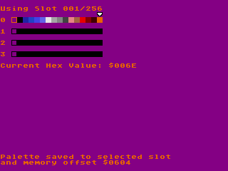

# Basic SEGA Genesis Palette Creator (for the SEGA Genesis)

I wanted to make a tool for Windows instead, but that was too much effort for my liking. So, here you go.

Here's what you get:

- Real-time previewing (by nature of the Genesis)
- 256 save slots
- I'm pretty sure that's it

Here's the controls:

- D-PAD: Move cursor
- A/B/C + Up/Down: Increment Red/Green/Blue channel on selected color
- Start + Left/Right: Change selected slot
- A + Start: Save current slot
  - NOTE: no warning is issued after sending this command. All decisions are final.
- A+B+C + Start: Overwrite ALL slots with the program's default palette
  - NOTE: no warning is issued after sending this command. All decisions are final.

This project was made using [SGDK](https://github.com/Stephane-D/SGDK). Your existing SGDK workspace should build this with no issues.